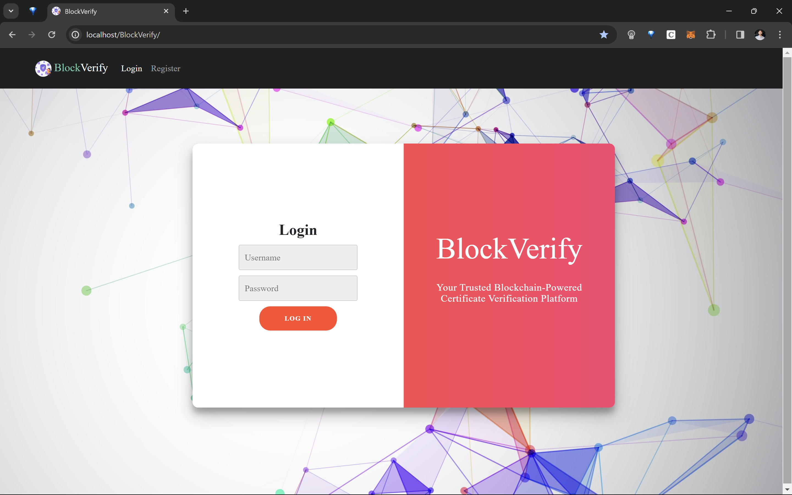
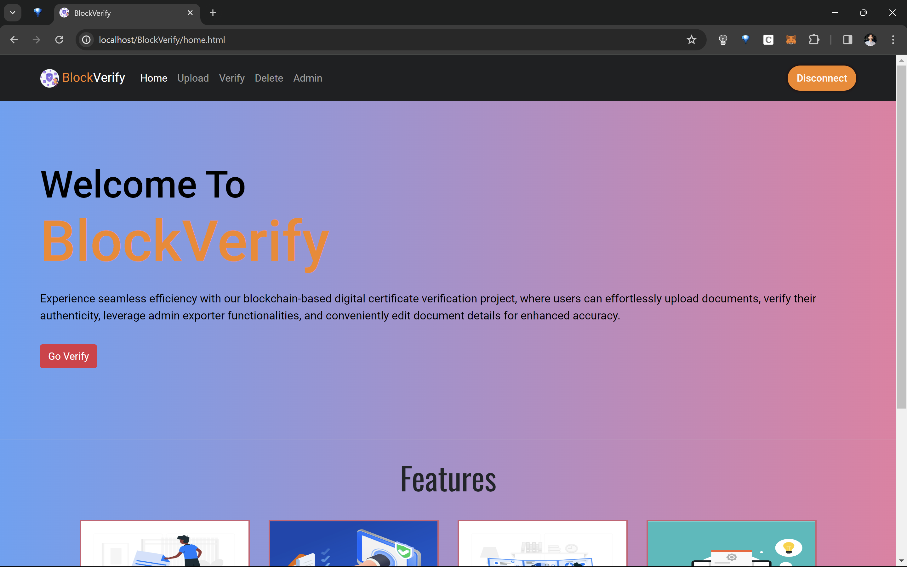
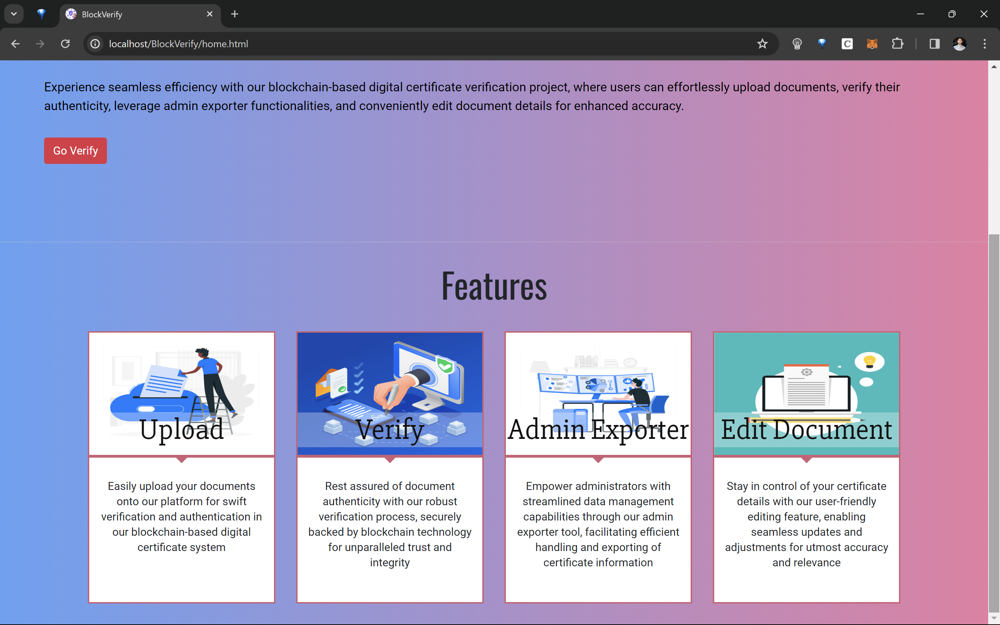
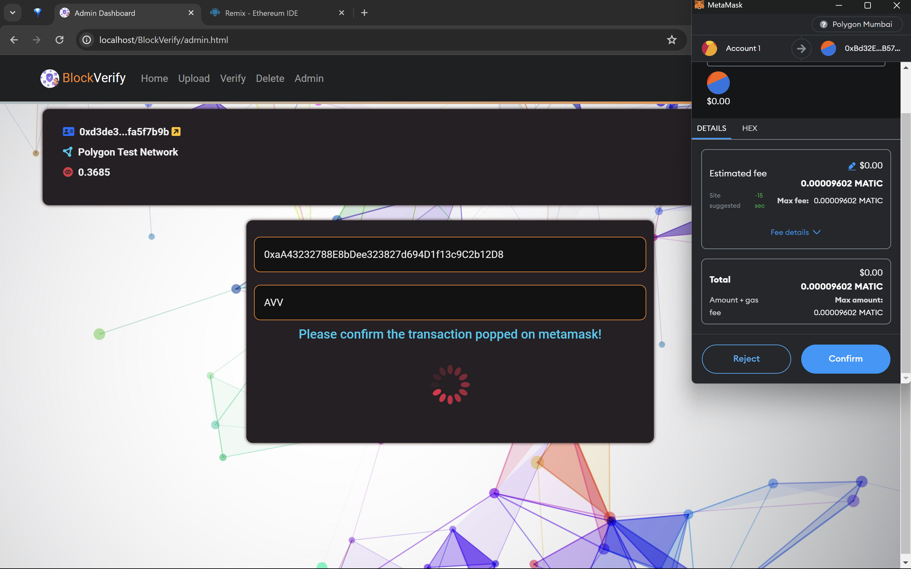
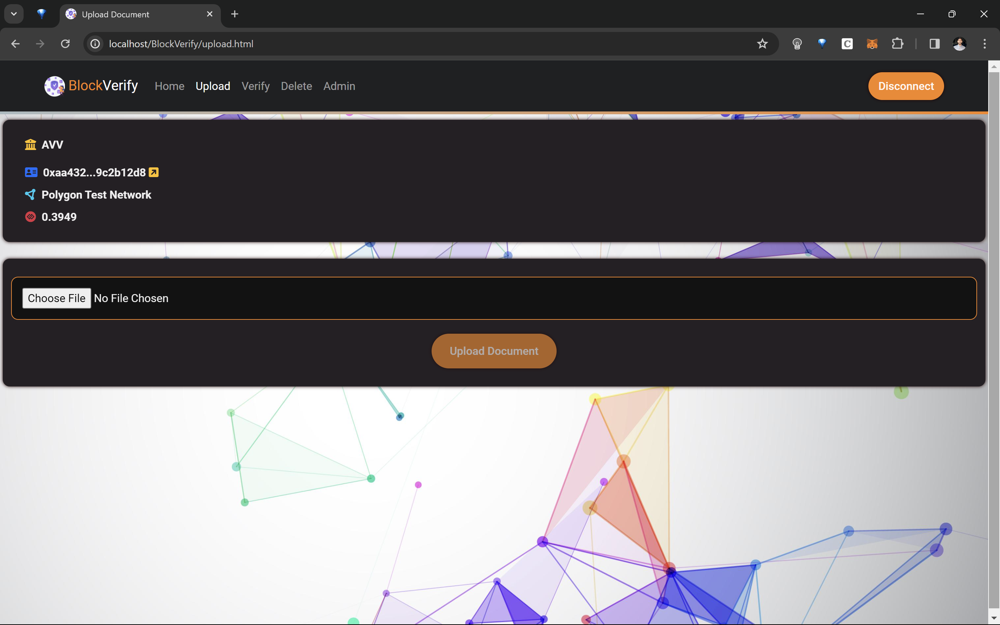
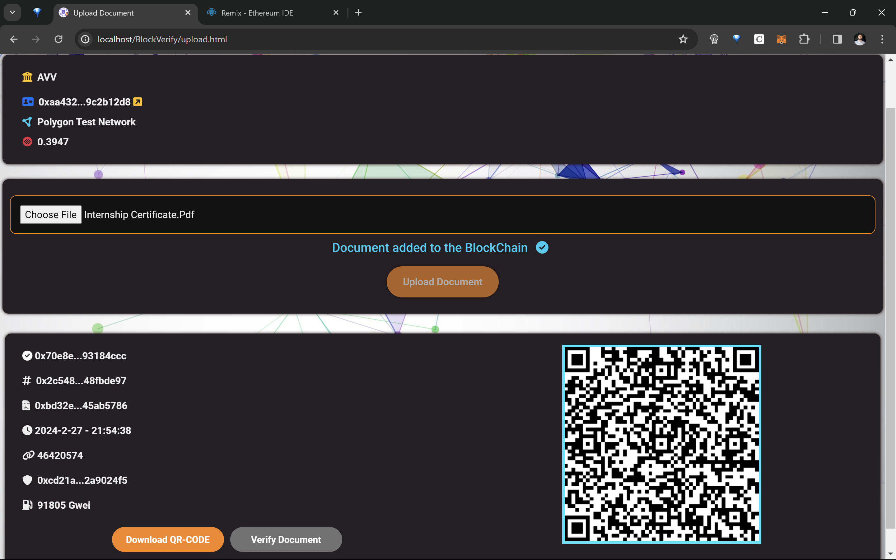

## 🔐 Project Overview: Blockchain-Based Document Verification Using IPFS

A decentralized, trustless platform for **secure document verification** using state-of-the-art **blockchain** and **IPFS** technologies. This solution ensures documents are:

- 💾 **Persistently Stored** via IPFS (InterPlanetary File System)  
- 🔗 **Tamper-Proof** with immutable hashes recorded on the **Polygon blockchain**  
- 🛡️ **Verifiable** without intermediaries — anyone can confirm authenticity using a document's hash  

---

## ⚙️ Tech Stack & Architecture

This project blends modern Web3 protocols with decentralized infrastructure to build a robust, scalable system:

| 🔧 Technology        | ⚡ Role in the System                                                 |
|---------------------|----------------------------------------------------------------------|
| `Solidity`          | Smart contract logic for registering/verifying document hashes       |
| `Polygon (MATIC)`   | Fast, low-cost Layer 2 blockchain hosting the contract                |
| `IPFS`              | Distributed storage for the actual documents                         |
| `MetaMask`          | Ethereum-compatible wallet to connect users with the dApp             |
| `Web3.js`           | Facilitates interaction between the frontend and the blockchain       |
| `JavaScript & HTML` | Frontend logic and structure                                          |
| `Live Server`       | Lightweight environment to preview the application locally            |

---

## 🌐 How It Works — At a Glance

1. 📥 A document is uploaded by an **authorized Exporter**
2. 🔐 It’s pinned to **IPFS**, generating a unique content-addressable hash
3. 🧾 The hash is stored on-chain via a smart contract, ensuring immutability
4. 🔍 Anyone can verify the document by comparing the retrieved IPFS hash with the on-chain record

> ✨ This hybrid system guarantees **data integrity**, **transparency**, and **cryptographic assurance** — redefining document verification for the decentralized age.

## 🚀 Highlights

🔐 Integrity-First: Hashes stored on-chain ensure document immutability

🌍 No Central Gatekeeper: Permissionless verification by design

⚡ Frictionless UX: Simplified upload/verify flow via connected MetaMask wallet

🗂️ Supports Many Formats: Upload PDFs, images, certificates, or other digital files

👨‍💼 Role-Based Access: Admin-exporter system for controlled submission

## ⚙️ System Prerequisites

Before you dive in, make sure you’ve got the essentials set up:

🧩 **Node.js & npm**  
- Core environment for running and building the project.  

🦊 **MetaMask Browser Extension**  
- For interacting with the blockchain directly from your browser.    

⛽ **Polygon Testnet Access**  
- You’ll need some free MATIC tokens for testing.  
 
🌀 **IPFS Client** *(Optional)*  
- Decentralized file storage tool — skip for now if IPFS isn't available.  

## 🔧 Installation

Get the project up and running with these quick steps:

📂 **Clone the Repository**  
  - Grab the source code into your local machine:  
  ``https://github.com/crazykush333/BlockVerify--Blockchain-Based-Document-Verification-Using-IPFS.git``

 📦 Install Dependencies and make sure all required Node.js packages are ready
 
 🦊 Set Up MetaMask
   - Create a MetaMask wallet (or use an existing one)
   - Add the Polygon (MATIC) Testnet to your MetaMask
   - 💰 Load test MATIC tokens → Use [Polygon Faucet](https://faucet.polygon.technology/)

 🧱 Deploy Smart Contract
   - Go to Remix IDE and connect MetaMask
   - Load and deploy the .sol contract
   - Copy the deployed contract address

🔌 Integrate Smart Contract
   - Paste the smart contract address into the appropriate place in your frontend code

 🌐 Run the Application
   - Launch the project using the Live Server extension or any static file server
   - Visit the site in your browser

 🔐 Connect & Assign Roles
   - Connect your MetaMask wallet to the site
   - Use one wallet to promote another to Admin

 📄 Upload & Verify Documents
   - Admin registers exporter accounts
   - Exporters upload documents
   - The system stores file in IPFS and its hash on-chain
   - 🎯 Verify authenticity using the stored hash 

## 🚀 Usage Guide

Once you're all set up, here's how to interact with the system:

👤 **Admin Login & Role Assignment**
  - Launch the web app in your browser
  - Connect your MetaMask wallet
  - Use one account to promote another as **Admin**

 ➕ **Add Exporter**
  - Admin clicks "Add Exporter"
  - Input the Ethereum address of a trusted user

 📤 **Upload Documents**
  - Exporter selects a file (PDF, image, certificate, etc.)
  - File gets stored on IPFS
  - The document's hash is stored securely on the blockchain

  🛡️ **Verify Documents**
  - Anyone can input a hash to verify its authenticity
  - The system cross-checks IPFS and on-chain data
  - ✅ Returns validity if hashes match  
  - ❌ Flags inconsistency for mismatched or tampered files

## 📝 License

This project is released under the [MIT License](./LICENSE.md).  
Feel free to use, modify, and distribute as per the terms outlined.

---

## 🙌 Acknowledgments

A huge shoutout to the tools and communities that made this project possible:

- 🦊 [**MetaMask**](https://metamask.io/) — For enabling seamless blockchain interactions through browser-based wallets  
- ⚙️ [**Solidity**](https://docs.soliditylang.org/) — The backbone of our smart contract logic  
- 🔗 [**Web3.js**](https://web3js.readthedocs.io/) — JavaScript library for communicating with Ethereum  
- 🌀 [**IPFS**](https://docs.ipfs.tech/) — For distributed file storage and content addressing  
- 🧪 [**Truffle Suite**](https://trufflesuite.com/) — Streamlining smart contract compilation and testing

> 💡 Special thanks to the open-source community for their inspiration and constant innovation.

## 🖼️ Sample Output

### 🔐 1. Login — Connect to Your Wallet
The first step to interacting with the dApp is secure authentication via MetaMask. Users are prompted to connect their wallet, which links them to the blockchain environment.

---

### 🏠 2. Homepage — Intuitive Dashboard
Once logged in, users land on a clean dashboard that serves as the control center.  
From here, users can view their role (Admin/Exporter), navigate actions like uploading or verifying documents, and manage blockchain interactions.

  

---

### 🧑‍💼 3. Admin Panel — Add Trusted Exporters
Only Admins can register Exporters (who are allowed to upload documents). This step ensures that document uploads are only handled by verified entities.  

> The Admin inputs the Exporter's wallet address, securing a trust-based upload system.

---

### 📤 4. Upload Document — Secure & Decentralized Storage
Exporters can choose a file (PDF, image, certificate, etc.) to upload.  
Once selected:
- The file is pinned to IPFS (ensuring decentralized storage)
- Its content hash is computed
- The hash is immutably stored on the blockchain via smart contract

> Tamper-proof, timestamped, and traceable — all in one step.

  

---

### 🔍 5. Verify Document — One Hash, Total Confidence
Anyone with the document's hash can check its authenticity:
- The dApp pulls the document from IPFS
- Computes its hash
- Compares it with the blockchain-registered hash

> ✅ If it matches — authentic  
> ❌ If not — possibly tampered or invalid  

## 📬 Contact

👤 **Maintainer**: Ayush Kushwaha  
✉️ **Email**: [ayushkushwaha21029@gmail.com](mailto:ayushkushwaha21029@gmail.com)  
📍 Built with ❤️ to make document authentication simpler, safer, and smarter.

  
